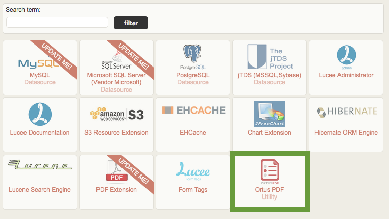

# Installation

## Lucee Setup

The extension is installed as a Lucee extension into any Lucee Server version `5.1.0` and above. The extension has to be installed at the **server-level context**.

.png>)

All web contexts created under the same Lucee instance will have the extension tags deployed to them automatically for you.

### **Installing the Extension**

Now click `Extensions > Applications` and wait for the list to load. There should be an item in the list called `Ortus PDF`. You can activate it as a trial or as a full version with a license key after you install it.

<figure><figcaption></figcaption></figure>

Click it and then click the `install` button to begin the installation process.


We recommend a complete server install so changes can take effect.


<figure><figcaption></figcaption></figure>

#### Manual/Docker Installation

Lucee also allows you to deploy the extension file (.lex) into a special folder.  Lucee will detect the extension and automatically install it for you.  The location is the following

```
{lucee-server}/WEB-INF/lucee-server/deploy
```

Just drop the [ortuspdf-2.0.0.lex](https://s3.amazonaws.com/downloads.ortussolutions.com/ortussolutions/lucee-extensions/ortuspdf/2.0.0/ortuspdf-2.0.0.lex) file in that folder, wait a few seconds, and it will automatically install. You can drop the file there before the server is started or during a started server.

If anything goes wrong during the installation, please verify the deploy logs in the following location

```
{lucee-server}/WEB-INF/lucee-server/context/logs/deploy.log
```

### **Activating the Extension**


If you do not see the menu, please completely restart your Lucee Server.


<figure><figcaption></figcaption></figure>

Production servers get only 1 activation, so make sure you choose the correct server type. Once you get all your information in the form, click on the `activate` button to finalize the installation. Choose the trial option if you don't have a license and just want to try out the extension. When the trial expires, the provider will stop working! **The trial is not for production use**.


Development servers are FREE of charge, and each license includes up to 4 activations. Production licenses are on a per Lucee instance and are allowed 1 activation. If you have any activation issues, please contact us at [support@ortussolutions.com](mailto:support@ortussolutions.com). Also, make sure you have a valid internet connection to activate your product.


The Ortus Lucee PDF Extension should now be installed on your server and ready to use.

### Downloading The Extension

If you will be using an offline installation or a Docker-based installation, you can either follow the process above or download the extension and leverage a continuous integration server to build your images or server configurations. Please note that you will need a containerized server license to use this extension across multiple images.

[https://downloads.ortussolutions.com/#/ortussolutions/lucee-extensions/ortuspdf/2.0.0/](https://downloads.ortussolutions.com/#/ortussolutions/lucee-extensions/ortuspdf/2.0.0/)

From our artifact repository, download the appropriate `lex` file and drop it into your Lucee deploy folder: `{lucee-server}/WEB-INF/lucee-server/deploy`. Once the engine starts, it will deploy the extension for you automatically.

#### Automatic Activation <a href="#automatic-activation" id="automatic-activation"></a>

If you will be using Kubernetes, Docker Swarm or any other orchestrator, you will need to automate the activation process.  There are two methods of providing your activation information to the extension:

1. Activation via a `properties` file in the extension filesystem
2. Activation via environment variables

Since you will likely want the server warmed up and ready to go, you may provide one of these two mechanisms in your build process.  With environment variable-based activation, there is no need to hard-code the license information into the container build, though you may do so.  Simply supply these environment keys at runtime or via a .env file.

#### Properties File License Configuration

To use the properties file method of license configuration, Create a `license.properties` file with the following content:

```bash
email=[The email address used to purchase your extension]
licenseKey=[The license key you were provided at registration]
activationCode=[The activation code for your extension and server type]
serverType=[ Activation type. Optional. Default to "Production"] 
```

And place it in the following location: `{lucee-server}/WEB-INF/lucee-server/context/context/ortus/pdf/license.properties`

Upon server startup, the file will be sourced in and the extension activated.&#x20;
